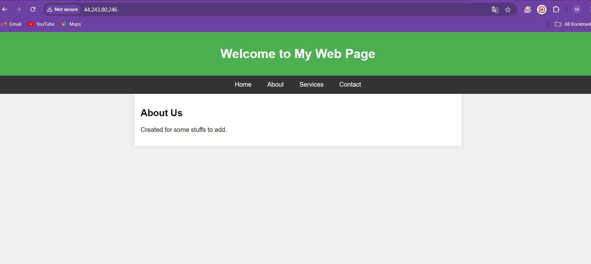

# AWS Infrastructure Deployment using Boto3

## Overview
This project automates the deployment of a scalable web application infrastructure on AWS using Python's Boto3 library. The infrastructure includes EC2 instances, an Application Load Balancer (ALB), an Auto Scaling Group (ASG), and SNS notifications for various events.

## Objective
The primary objective of this project is to provide a robust and scalable web hosting environment. This involves:
- Deploying EC2 instances to host a web application.
- Setting up an Application Load Balancer to distribute traffic.
- Configuring an Auto Scaling Group for dynamic scaling based on traffic demand.
- Implementing SNS notifications to monitor health and scaling events.

## Prerequisites
Before running the scripts, ensure you have the following:
- An AWS account with necessary permissions to create EC2 instances, Load Balancers, Auto Scaling Groups, and SNS topics.
- Python 3.x installed on your machine.
- Boto3 library installed. You can install it using pip:
  ```bash
  pip install boto3
## Technologies Used
AWS Services: EC2, ALB, ASG, SNS
Programming Language: Python
Library: Boto3 for AWS SDK
Infrastructure as Code: Automated deployment through scripting
AWS CLI configured with appropriate credentials and default region.

## Features
S3 Bucket for Static Files
-Create an S3 bucket to store your web application's static assets.

EC2 Instance for Web Server
-Launch an EC2 instance configured as a web server (Nginx or Apache).
-Deploy the web application onto the EC2 instance.

Load Balancer (ALB)
-Deploy an Application Load Balancer (ALB).
-Register the EC2 instance(s) with the ALB to distribute traffic.

Auto Scaling Group (ASG)
-Create an Auto Scaling Group (ASG) with scaling policies based on CPU utilization or network traffic.
-Use the deployed EC2 instance as a template for the ASG.

SNS Notifications
-Set up SNS topics for various alerts (health issues, scaling events, traffic alerts)
-Integrate SNS with Lambda to notify administrators via SMS or email.

Infrastructure Automation
-Manage the entire infrastructure lifecycle—deploy, update, and tear down—all within a single Python script.

## Deployment Steps

1. Create an S3 Bucket and Upload Static Files
The Create_s3_boto3.py script will:

Create an S3 bucket.
Upload static web files (HTML) to the bucket.


3. Launch an EC2 Instance as Web Server
The Access_Ec2.py script will:

Launch an EC2 instance.
Configure AWS and then move file to var/www/html location from s3 & then it will run a web server (Nginx or Apache).
Deploy the web application to the instance.

Similarly Access_ec2_2.py will generate another ec2 instance with same configurations.


3. Deploy an Application Load Balancer (ALB)
The load_balancer script will:

Create an ALB.
Register the EC2 instance(s) with the ALB to distribute traffic across them


4. Set Up an Auto Scaling Group (ASG)
The ASG.py script will:

Create an Auto Scaling Group (ASG) using the EC2 instance as a template.
Configure scaling policies to adjust the number of instances based on CPU or network traffic metrics.


5. Configure SNS Notifications
The SNS.py script will:

Create SNS topics for health, scaling events, and traffic alerts.
Set up Lambda functions to notify administrators via email or SMS.

6. Deploy, Update, and Tear Down Infrastructure
The infra_teardown.py script will:

Deploy all components in sequence.
Update any components as required.
Tear down all resources when the application is no longer needed.


Some Script Parameters commonly used during the scripting:

AMI ID: Ensure you use the correct AMI ID for region.
VPC ID: Provide the correct VPC ID for setup.
Subnets: Update with available subnet IDs.
Key Pair: Replace with  existing EC2 key pair name.
Security Group: Use the correct security group ID.
Run the Main Deployment Script:
Monitor the Deployment: The script will output the status of each component as it is created.

## Verify the Results
After running the script, verify the deployment by:

Checking the EC2 Instances: Ensured they are in a running state and accessible.
Accessing the Load Balancer DNS: Used the provided DNS name to confirm that the web application is serving content correctly.
Reviewing the SNS Notifications: Confirmed that I receive alerts for any scaling events or health issues.


